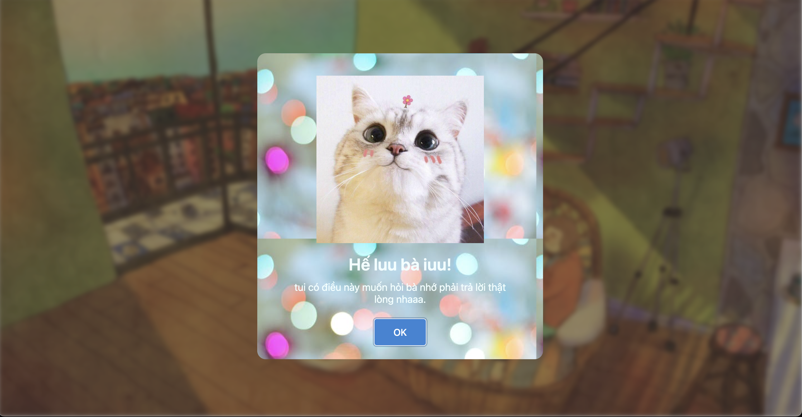

# express-to-the-one-you-love

Show your love for the one you love! This project is a heartfelt and creative way to express your feelings, designed to bring joy and connection to you and your loved one.

## Features

- **Wallpaper**: Cute images that will make your loved one fall in love.
- **Interactive display**: Users can click or tap to experience.
- **Sound**: Funny and cute sounds.

## Demo

Check out a live demo here: [express-to-the-one-you-love Demo](https://dangtiendung1409.github.io/express-to-the-one-you-love/) *(Replace with the demo link)*

## Installation

Clone this repository to your local machine:

```bash
git clone https://github.com/dangtiendung1409/express-to-the-one-you-love.git
cd express-to-the-one-you-love
```

Open the `index.html` file in your browser to view the fireworks display.

## Usage

1. Open the project in a browser.
2. Click or tap on the screen to launch fireworks.
3. Enjoy the show!

## How It Works

This project is built using:

- **HTML**: For the structure of the page.
- **CSS**: To style the display.
- **JavaScript**: To create and animate.

## Screenshots

  
*Image shows what you want to say to the person you love.*

## Show off to the person you love instantly! 💖

We hope this project will help developers find the one they love
